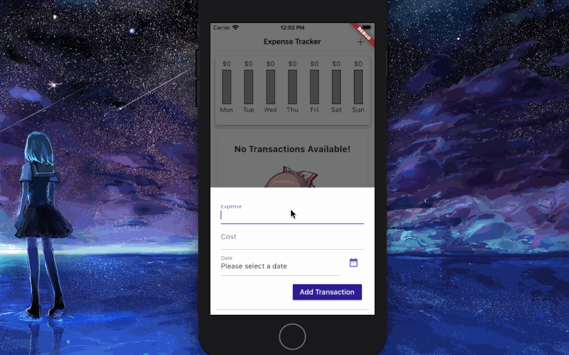

# Expense Tracker

An IOS/Android application for users to keep track of their expenses

## Technologies Used

- Flutter 1.22
- Dart 2.33

## Features

- User can add expense
- User can delete expense
- User can edit expense
- User can switch to landscape mode
- User can select date of expense
- User can see chart of expenses based of day of the week

## Preview

<p align="center">
  
</p>

## Development

#### System Requirements

- MacOS Catalina (IOS only)
- XCode (IOS only)
- Android Studio (Android only)
- Dart SDK
- Flutter SDK
- Cocoapods

#### Getting Started

1. Clone the repository
  ```shell
  git clone https://github.com/uzair-ashraf/expense-tracker.git
  ```

2. Install dependencies
  ```shell
  flutter pub get
  ```

3. Compile your code
  ```shell
  flutter run
  ```
